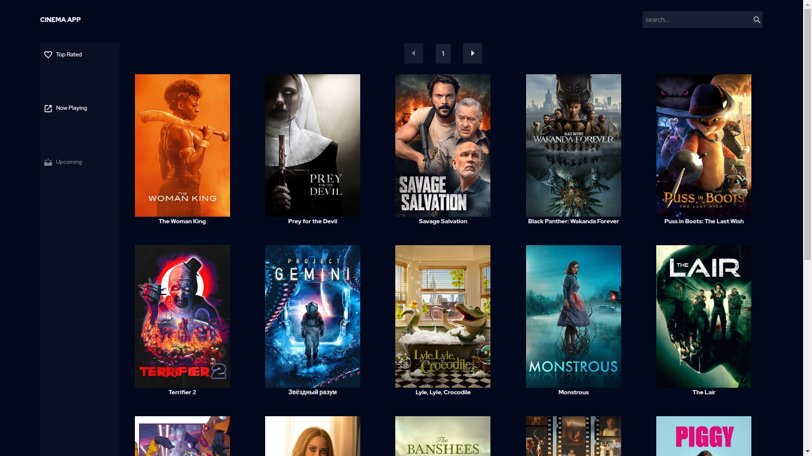
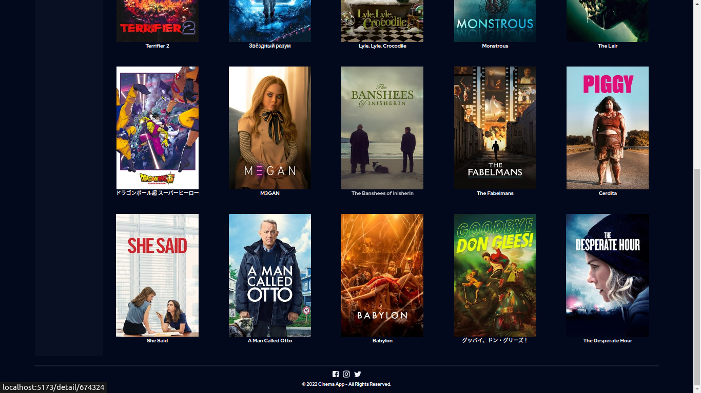
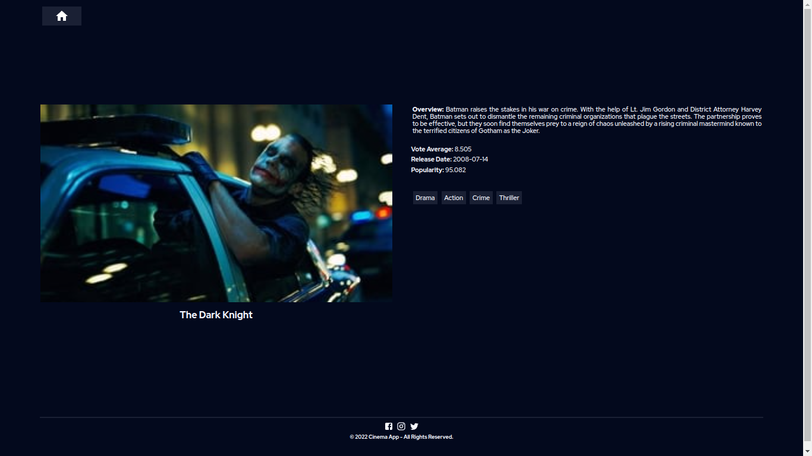

## 🎦 Cinema App

#

#

### I developed this project to gain experience using React JS technology in conjunction with Context as a way to handle global state and apply CSS Grid technology as a technique for structuring and styling the web application's UI.

#

### Technologies used in the project: _React JS_, _Sass_,_Git_ and _Vercel_ for deployment.

- [LinkedIn](https://www.linkedin.com/in/carlosgabrielcarreno/)

## See live example:

- [Link to deployment](https://cinema-app-ochre.vercel.app/)
